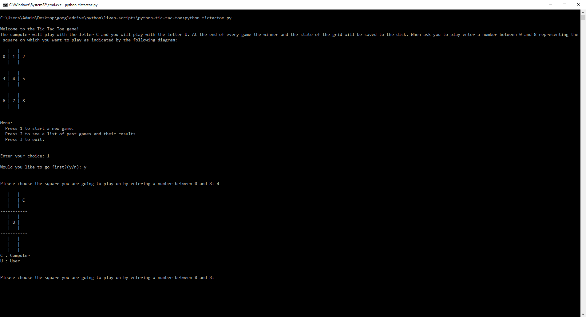
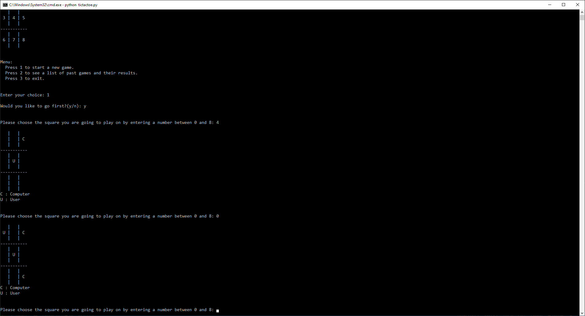
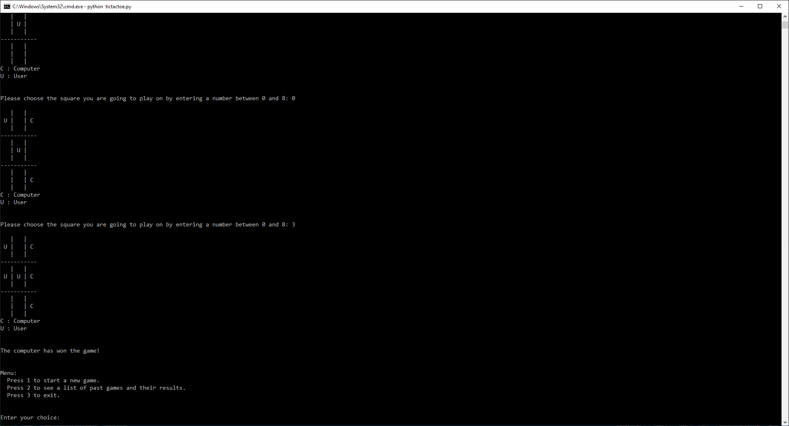
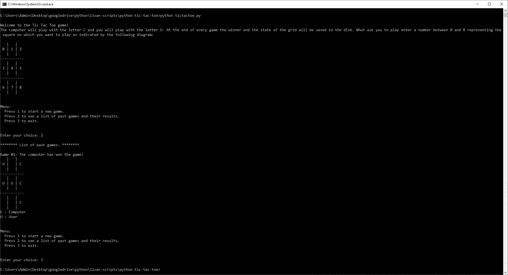
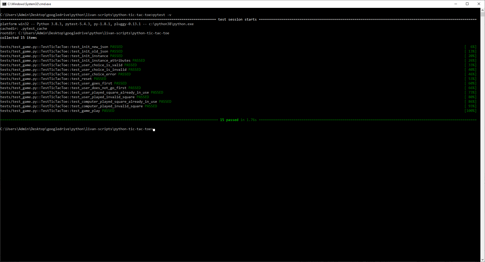

# tic-tac-toe-python
Well here we go again with another Tic-Tac-Toe game. This time in the form of a Python script. 

To run it from the terminal just type: python tictactoe.py

python 3.8.3

pytest 5.4.3

pip install pytest

pip install mock

Happy Tic-Tac-Toe!